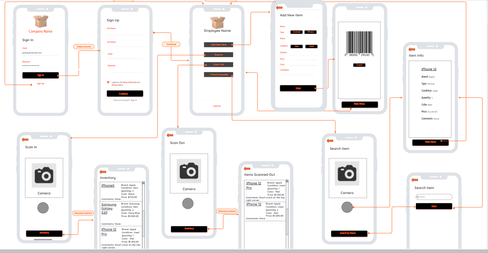
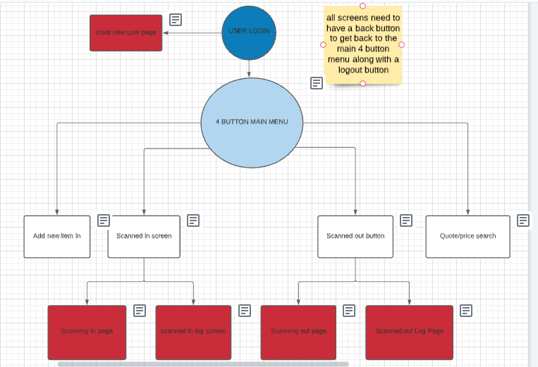

# Group-3

Design Document for______Business Inventory___________

Authors:____Samir Macias, Mark Peres, Jesus Rodriguez, Megan Jen__________

Date:_____2/9/2021___________

Status: __Design_______________

## Concept Summary

Our project is going to manage the inventory of any business, by being able to add or remove items from the database.

## Audience/Customer

Intended audience or customer has first name, last name, email, and item they choose to scan.

## Background

The background information necessary to understand the project includes the appropriate price and quantity of the item the user chooses to add to or remove from the database according to the brand. It would also include definitions and current events for updates of the app’s features.

## Application Cost and Projected success

For application cost, we would start with our app being a free app to obtain a good start with some people to more people purchasing our app while we fix bugs or add more features suggested by customers or self-decided, then we would start to increase the price as our projected success starts to increase, starting with $0.99.

## Interface Mockups

 

## Design - Use Case Diagram(s) 

 

## Design - Detailed Design

The design will first have the log in page containing the username and password, as well as a sign up button if the user does not have an account for the app. The sign up button will lead to a page which contains the first name, last name, email, and password, and a checkbox for the user to check to agree to the terms of service and privacy policy. It will have a continue button and below that, a link to the sign in page if the user already has an account. Both the continue button in the sign up page and the sign in button in the start page will lead to the user’s profile, containing the options to add a new item, scan in, scan out, and price and quantity, and under the four options, a log out link to bring the user to the start page. The add new item button first leads to eight inputs; the item’s name, type, brand, condition, quantity, price, color, and comments. The type input has the user tap on the Android or iPhone brand, and condition has the user tap on either the new condition or used condition. Under the inputs, there is an Enter button which leads the user to a barcode with an export button under it, and under the barcode and export button is a main menu button leading the user to their profile. The export button under the barcode exports the item the user has described, and the barcode is scanned in to add the item to the inventory. The scan in button leads to a camera, then a scanned in page and a scanned in log screen once the user has scanned an item. The scanned out button shows a scanned out page and the scanned out log page, and the quote/price search scans an item and shows the description of the item scanned.

## Related Work

Related products would be Warehouse management from the Play Store to hold items in users’ inventories.

## Frameworks/Services/Cloud/Backends

We will be using Android as a framework, and google for searching for item qualities to display to the user after scanning an item with the app.

## Testing

-A first account, normally a test account would be created by a volunteer from the industry. The volunteer would then try adding a new item and accessing the barcode and the quality of the item which they inserted into the app. They would then try scanning in an item with the camera to check the inventory, as well as scanning out an item from the inventory. The volunteer will finally scan an item to read its quality and price. They will then fill out a survey on their experience with our app and include on how it can be improved.

## Dependencies

The dependencies of this work to be completed would be an understanding of the brands and qualities of items the user would be to scan with the app.
